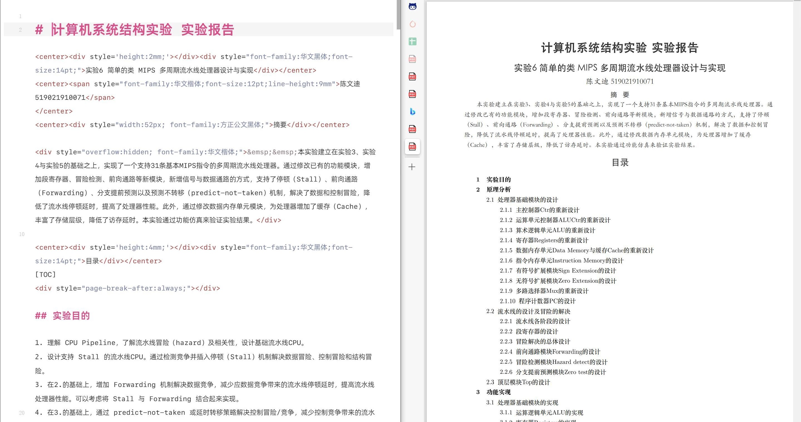
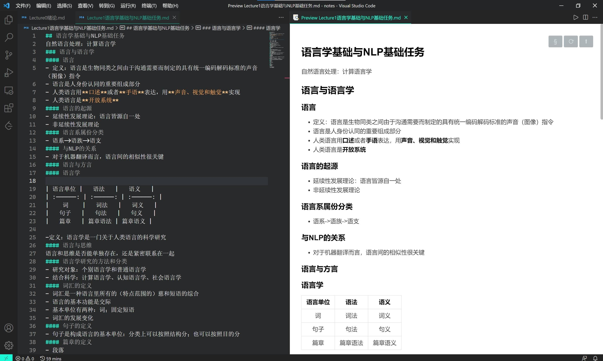

[TOC]


在一切开始之前：你可以知道`Ctrl`+`/`可以用来切换<u>源代码</u>模式和<u>预览</u>模式:seedling:，并且试一试

**课前的可选事项**

- [ ] 熟悉一下`Typora`的工具栏（就在上方），主要是`段落`、`格式`、`试图`以及`文件`里的导出和偏好设置
- [ ] 稍微熟悉一下**简介**部分的**参考资料**

还有一点：本文旨在提供一种较为简单和美观的编写文档工具的教程，如果你已经熟悉掌握了其它同类型的工具（word/LaTex...)，你可以不选择`markdown`，把这篇教程当作一篇了解性的读物


# Q：为什么要使用markdown？

1. 更好地展示代码:thinking:

    ```c++
    int main()
    {
        // something
        return 0;
    }
    ```
    
2. 以及公式:thinking:
    $$
    \begin{aligned}
    \mathcal{L}(\pi, \beta)&=\int_{\mathbf{s}} d_{\mu}(\mathbf{s})  \int_{\mathbf{a}} \pi(\mathbf{a} \mid \mathbf{s})  \left[\mathcal{R}_{\mathbf{s},  \mathbf{a}}^{\mu}-V^{\mu}(\mathbf{s})\right] d \mathbf{a} d \mathbf{s}\\&+\beta\left(\epsilon-\int_{\mathbf{s}} d_{\mu}(\mathbf{s}) \mathrm{D}_{\mathrm{KL}}(\pi(\cdot \mid s) \| \mu(\cdot \mid \mathrm{s})) d \mathrm{~s}\right)
    \end{aligned}
    $$
    
3. 清晰的层次:thinking:

    看看整个文档的最上面

    或者在`视图`选项里打开`大纲`再看看**左边**

4. 编程式撰写:thinking:

    > 这是怎么来的？

    先输入`>`，之后输入空格，再输入文字就好了

## 优点

- 在代码和数学公式方面，比word更美观和简洁

- 在整个文档编写方面，比Latex更简洁

## 缺点

- 不如LaTex灵活
- 不方便或者不能做做的一些事
  - 调整图片位置
  - 调整字体与字号，居中，艺术字
  - 页眉
  - ...

但`mardown`本质是`html`，其实可以解决（了解即可）




# 简介

## 参考资料

首先，善于使用你的搜索引擎:smiley:

这里给出一些可能比较好用的建议

### 数学公式

1. [_在线编辑器_](https://www.latexlive.com/)（强烈推荐自己先玩一玩）
2. [_做数学笔记常用的Latex小结_](https://www.jianshu.com/p/cd314c14eeb9)
3. [_手写识别_](http://detexify.kirelabs.org/classify.html)
4. mathpix（强烈推荐）

### markdown

1. [_菜鸟教程_](https://www.runoob.com/markdown/md-tutorial.html)
3. `Typora`的所有设置和快捷键
4. markdown官方文档
4. 网上随处可见的一些博客，例如[_markdown语法介绍_](https://zhuanlan.zhihu.com/p/90561228)

### ~~emoji表情~~

1. [_cheat sheet_](https://gist.github.com/rxaviers/7360908)
2. [_Emoji Cheat Sheet_](https://www.webfx.com/tools/emoji-cheat-sheet/)

### markdown主题（仅限`Typora`使用）

1. `Typora`自带的主题

2. [_theme.typora_](https://theme.typora.io/)


## markdown基础语法

### 三级标题

#### 四级标题

##### 五级标题

###### 六级标题

**加粗**、*倾斜*、<u>下划线</u>、~~删除线~~、==高亮==、上标^上标^、下标~下标~、[链接](链接)、[链接][链接]、`代码`、脚注[^1]

[^1]: 脚注。Lorem ipsum dolor sit amet, consectetur adipiscing elit, sed do eiusmod tempor incididunt ut labore et dolore magna aliqua.

> 苟利国家生死以

---


块元素：

+ 无序列表
+ 充分等等
  + 无序列表的递进
  + 仍然会好久哦经济
    1. 无序列表下的有序列表
    2. 日日日动词
       1. 有序列表下的递进
       2. 顶顶顶方法
          - [ ] 待办事项
          - [x] 待办事项

```bash
chmod +x xxx.sh
```

$$
\begin{equation}
x^n+y^n=z^n	\tag{1.5}
\end{equation}
$$

$10 \equiv 1 \pmod{9} $

| 左对齐 | 右对齐 | 居中对齐 |
| :----- | -----: | :------: |
| 单元格 | 单元格 |  单元格  |
| 单元格 | 单元格 |  单元格  |

转义：\*

**切换主题**：在上方的`主题`选项切换


## 一些具体的例子

- 来自陈文迪的笔记

  

- 来自叶航宇的report

  [Link](https://jbox.sjtu.edu.cn/v/link/view/4db2694a72ce462d951a868725e14215)


> By [cwher](https://github.com/CWHer)